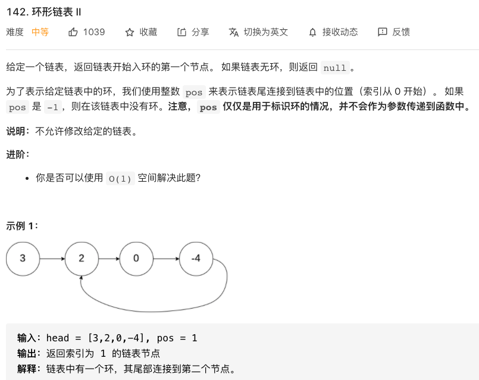

# TPLink

**TPLink提前批，投递职位为嵌入式软件开发工程师。**

1. LeetCode 4.寻找两个正序数组的中位数：https://leetcode-cn.com/problems/median-of-two-sorted-arrays/

   使用二分法可以达到O(lg(m+n))的时间复杂度，但是很麻烦。时间复杂度是O(m+n)的解法：

   ```C++
   class Solution {
   public:
       double findMedianSortedArrays(vector<int>& nums1, vector<int>& nums2) {
           int m = nums1.size();
           int n = nums2.size();
           vector<int> num(m+n);
   
           // len为奇数时，中位数为num[len/2];len为偶数时，中位数为(num[len/2]+num[len/2-1])/2
           int index1 = 0;
           int index2 = 0;
           int i = 0;
           int len = m+n;
           while (index1<m && index2<n)
           {
               if (nums1[index1] <= nums2[index2])
                   num[i] = nums1[index1++];
               else
                   num[i] = nums2[index2++];
               ++i;
           }
   
           if (index1 == m)
           {
               for (;i<len;++i)
                   num[i] = nums2[index2++];
           }
           else if (index2 == n)
           {
               for (;i<len;++i)
                   num[i] = nums1[index1++];
           }
   
           if (len%2 == 0)
               return (num[len/2]+num[len/2-1])/2.0;
           return num[len/2];
       }
   };
   ```

   

2. LeetCode 142.环形链表II: 

   [环形链表II](https://leetcode-cn.com/problems/linked-list-cycle-ii/solution/linked-list-cycle-ii-kuai-man-zhi-zhen-shuang-zhi-/)
   
   
   
   ```c++
   /**
    * Definition for singly-linked list.
    * struct ListNode {
    *     int val;
    *     ListNode *next;
    *     ListNode(int x) : val(x), next(NULL) {}
    * };
    */
   class Solution {
   public:
       ListNode *detectCycle(ListNode *head) {
           ListNode* MeetingNode = meetingNode(head);
           if (MeetingNode == nullptr)
               return nullptr;
           ListNode* temp = head;
           while (temp != MeetingNode)
           {
               temp = temp->next;
               MeetingNode = MeetingNode->next;
           }
           return MeetingNode;
       }
   
       ListNode* meetingNode(ListNode *head)
       {
           if (head == nullptr)
               return head;
           ListNode* pFast = head;
           ListNode* pSlow = head;
           while (pFast->next != nullptr)
           {
               pSlow = pSlow->next;
               pFast = pFast->next;
               if (!(pFast->next))
                   return nullptr;
               else
                   pFast = pFast->next;
               if (pFast == pSlow)
                   return pFast;
           }
           return nullptr;
       }
   };
   ```
